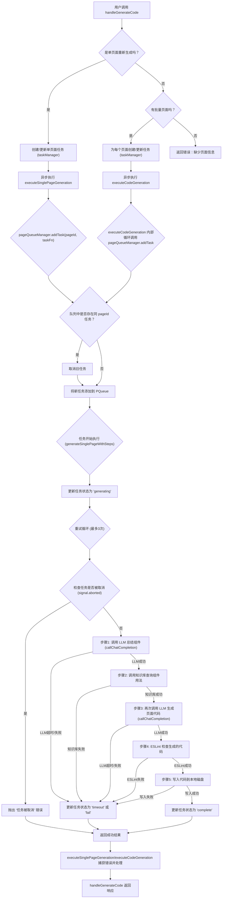

<table dir="auto" class="w-fit min-w-[calc(var(--content-width)-13px)] [&amp;&gt;thead&gt;tr&gt;th:last-child]:pr-8"><thead class="sticky [top:var(--thead-sticky-top)] [&amp;_th]:h-10 [background-color:var(--thead-bg-color)] [box-shadow:0_1px_0_0_var(--thead-border-b-color)] border-b-0" node="[object Object]"><tr class="border-primary/10" node="[object Object]"><th class="break-words" data-col-size="lg" node="[object Object]">需求</th><th class="break-words" data-col-size="xl" node="[object Object]">调用方式</th><th class="break-words" data-col-size="xs" node="[object Object]">重试次数</th><th class="break-words" data-col-size="md" node="[object Object]">超时时间</th><th class="break-words" data-col-size="md" node="[object Object]">代码示例</th></tr></thead><tbody><tr class="border-primary/10" node="[object Object]"><td class="break-words" data-col-size="lg" node="[object Object]" style="white-space: pre-wrap;"><strong class="font-semibold" node="[object Object]">重试3次（当前默认）</strong></td><td class="break-words" data-col-size="xl" node="[object Object]" style="white-space: pre-wrap;">callWithTimeoutAndRetry(task, 3, 120000)</td><td class="break-words" data-col-size="xs" node="[object Object]" style="white-space: pre-wrap;">3次</td><td class="break-words" data-col-size="md" node="[object Object]" style="white-space: pre-wrap;">2分钟</td><td class="break-words" data-col-size="md" node="[object Object]" style="white-space: pre-wrap;">✅ 当前实现</td></tr><tr class="border-primary/10" node="[object Object]"><td class="break-words" data-col-size="lg" node="[object Object]" style="white-space: pre-wrap;"><strong class="font-semibold" node="[object Object]">重试1次</strong></td><td class="break-words" data-col-size="xl" node="[object Object]" style="white-space: pre-wrap;">callWithTimeoutAndRetry(task, 1, 60000)</td><td class="break-words" data-col-size="xs" node="[object Object]" style="white-space: pre-wrap;">1次</td><td class="break-words" data-col-size="md" node="[object Object]" style="white-space: pre-wrap;">1分钟</td><td class="break-words" data-col-size="md" node="[object Object]" style="white-space: pre-wrap;">改参数即可</td></tr><tr class="border-primary/10" node="[object Object]"><td class="break-words" data-col-size="lg" node="[object Object]" style="white-space: pre-wrap;">**<strong class="font-semibold" node="[object Object]">无重试，只超时</strong></td><td class="break-words" data-col-size="xl" node="[object Object]" style="white-space: pre-wrap;">Promise.race([task(signal), timeoutPromise])</td><td class="break-words" data-col-size="xs" node="[object Object]" style="white-space: pre-wrap;">0次</td><td class="break-words" data-col-size="md" node="[object Object]" style="white-space: pre-wrap;">可控</td><td class="break-words" data-col-size="md" node="[object Object]" style="white-space: pre-wrap;">手动包装</td></tr><tr class="border-primary/10" node="[object Object]"><td class="break-words" data-col-size="lg" node="[object Object]" style="white-space: pre-wrap;"><strong class="font-semibold" node="[object Object]">无重试无超时</strong></td><td class="break-words" data-col-size="xl" node="[object Object]" style="white-space: pre-wrap;">await task(null)</td><td class="break-words" data-col-size="xs" node="[object Object]" style="white-space: pre-wrap;">0次</td><td class="break-words" data-col-size="md" node="[object Object]" style="white-space: pre-wrap;">无</td><td class="break-words" data-col-size="md" node="[object Object]" style="white-space: pre-wrap;">最简单</td></tr></tbody></table>

---

<table dir="auto" class="w-fit min-w-[calc(var(--content-width)-13px)] [&amp;&gt;thead&gt;tr&gt;th:last-child]:pr-8"><thead class="sticky [top:var(--thead-sticky-top)] [&amp;_th]:h-10 [background-color:var(--thead-bg-color)] [box-shadow:0_1px_0_0_var(--thead-border-b-color)] border-b-0" node="[object Object]"><tr class="border-primary/10" node="[object Object]"><th class="break-words" data-col-size="lg" node="[object Object]">功能</th><th class="break-words" data-col-size="lg" node="[object Object]">axios timeout</th><th class="break-words" data-col-size="lg" node="[object Object]">Promise.race + AbortController</th></tr></thead><tbody><tr class="border-primary/10" node="[object Object]"><td class="break-words" data-col-size="lg" node="[object Object]" style="white-space: pre-wrap;">单次 HTTP 请求超时</td><td class="break-words" data-col-size="lg" node="[object Object]" style="white-space: pre-wrap;">✅</td><td class="break-words" data-col-size="lg" node="[object Object]" style="white-space: pre-wrap;">✅</td></tr><tr class="border-primary/10" node="[object Object]"><td class="break-words" data-col-size="lg" node="[object Object]" style="white-space: pre-wrap;"><strong class="font-semibold" node="[object Object]">整个任务链超时</strong>（多次模型调用 + 工具执行）</td><td class="break-words" data-col-size="lg" node="[object Object]" style="white-space: pre-wrap;">❌</td><td class="break-words" data-col-size="lg" node="[object Object]" style="white-space: pre-wrap;">✅</td></tr><tr class="border-primary/10" node="[object Object]"><td class="break-words" data-col-size="lg" node="[object Object]" style="white-space: pre-wrap;">主动取消时能立即中断正在进行的 axios 请求</td><td class="break-words" data-col-size="lg" node="[object Object]" style="white-space: pre-wrap;">❌（需要手动传 signal）</td><td class="break-words" data-col-size="lg" node="[object Object]" style="white-space: pre-wrap;">✅（abort() 会触发 signal.abort）</td></tr><tr class="border-primary/10" node="[object Object]"><td class="break-words" data-col-size="lg" node="[object Object]" style="white-space: pre-wrap;">超时后强制抛错，不依赖底层 HTTP 实现</td><td class="break-words" data-col-size="lg" node="[object Object]" style="white-space: pre-wrap;">依赖 node/axios</td><td class="break-words" data-col-size="lg" node="[object Object]" style="white-space: pre-wrap;">完全由 JS setTimeout 控制，更可靠</td></tr><tr class="border-primary/10" node="[object Object]"><td class="break-words" data-col-size="lg" node="[object Object]" style="white-space: pre-wrap;">支持重试逻辑</td><td class="break-words" data-col-size="lg" node="[object Object]" style="white-space: pre-wrap;">❌</td><td class="break-words" data-col-size="lg" node="[object Object]" style="white-space: pre-wrap;">✅（外层 for 循环）</td></tr></tbody></table>

